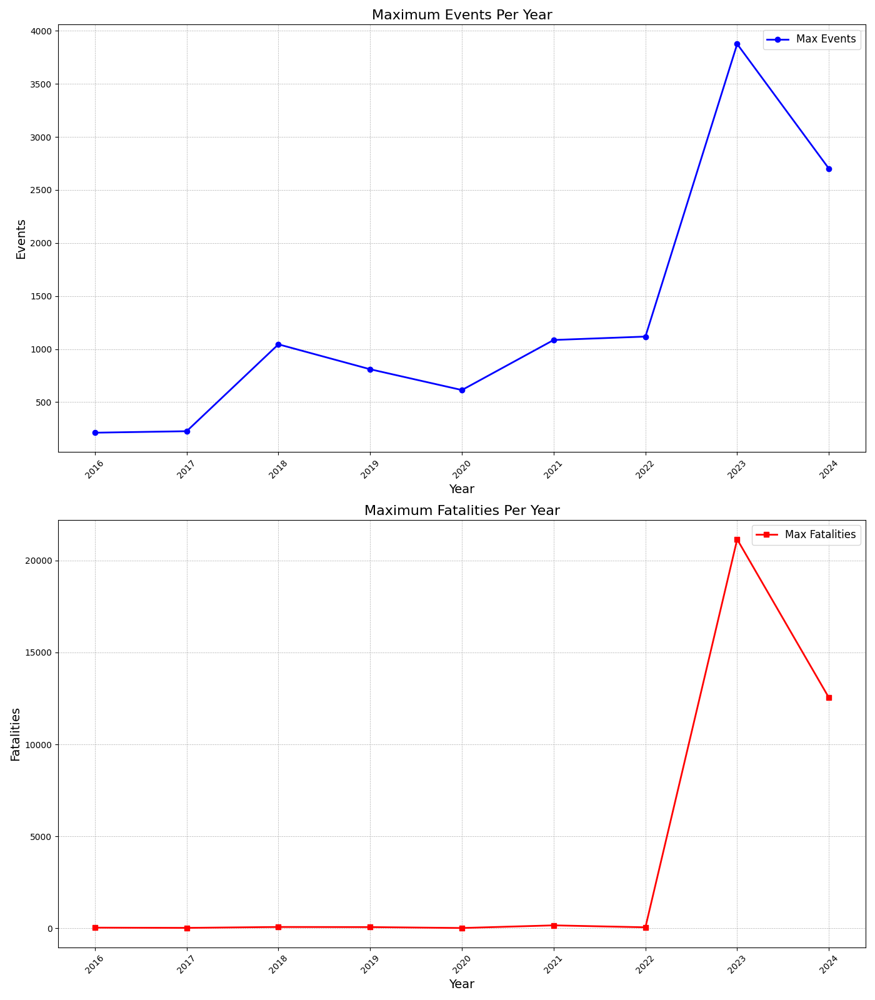
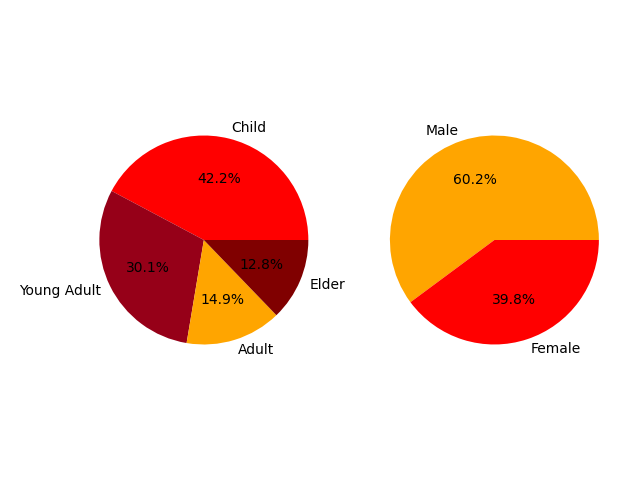
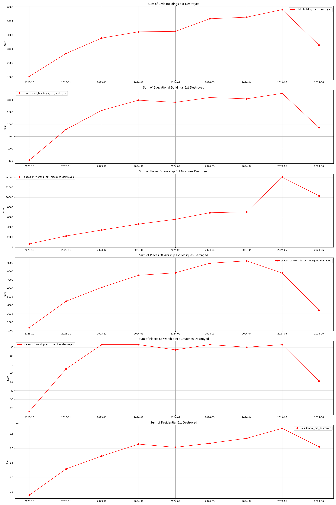

# Gaza-

## Some facts.

The ongoing war in Gaza has cast a long, dark shadow over countless lives. Families are torn apart, homes reduced to rubble, and the once vibrant streets now echo with the sounds of despair and destruction. The relentless conflict has forced many to flee, leaving behind everything they once knew and loved. Children, who should be playing and learning, are instead growing up amidst fear and uncertainty. The humanitarian crisis deepens with each passing day, as basic necessities become scarce and hope seems like a distant memory. The pain and suffering are palpable, and the yearning for peace grows ever more desperate. This war, like all wars, leaves behind scars that may never fully heal, reminding us of the profound cost of conflict.
**These numbers are from October 2023 to June 2024, and the destruction, devastation, and death continue**

The number of deaths reached approximately 35,000 according to the announced figures, and the number of injuries was estimated to be in the thousands

The first chart reveals that children constitute the largest percentage of the deceased at 42.2%, followed by young adults at 30.1%, adults at 14.9%, and elders at 12.8%. This highlights a significant impact on younger populations, which could have profound social and economic implications. The second chart shows a gender distribution where males represent 60.2% of the deceased, compared to 39.8% females.
The high percentage of children (42.2%) and young adults (30.1%) among the deceased is deeply alarming. These numbers highlight the devastating impact of the conflict on the younger population, and not like they said that they didn't target them.

**The following table illustrates the extent of destruction and devastation that occurred to buildings, which did not only include residential homes but also extended to hospitals and places of worship**

**The number of destroyed residential homes reached approximately 16,819,456, while around 35,461 civilian homes were damaged. Educational buildings were not spared, with about 93,019 structures affected. Places of worship could not escape this devastation either, with approximately 56,628 mosques and 681 churches being destroyed**

***The war is still ongoing, and the destruction, devastation, and death toll are rising***
## Free Palestine 
