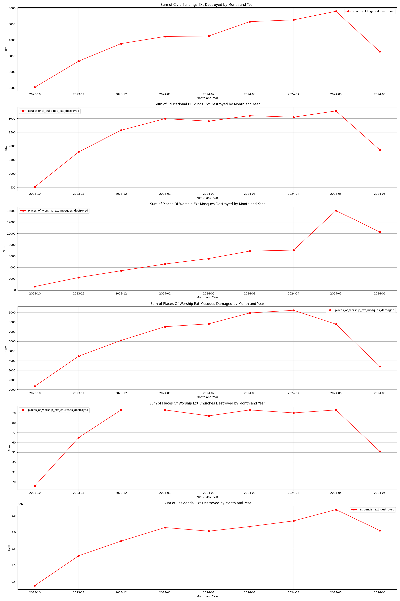

# Gaza-

## Some facts.

The ongoing war in Gaza has cast a long, dark shadow over countless lives. Families are torn apart, homes reduced to rubble, and the once vibrant streets now echo with the sounds of despair and destruction. The relentless conflict has forced many to flee, leaving behind everything they once knew and loved. Children, who should be playing and learning, are instead growing up amidst fear and uncertainty. The humanitarian crisis deepens with each passing day, as basic necessities become scarce and hope seems like a distant memory. The pain and suffering are palpable, and the yearning for peace grows ever more desperate. This war, like all wars, leaves behind scars that may never fully heal, reminding us of the profound cost of conflict.
**These numbers are from October 2023 to June 2024, and the destruction, devastation, and death continue**

The first chart reveals that children constitute the largest percentage of the deceased at 42.2%, followed by young adults at 30.1%, adults at 14.9%, and elders at 12.8%. This highlights a significant impact on younger populations, which could have profound social and economic implications. The second chart shows a gender distribution where males represent 60.2% of the deceased, compared to 39.8% females.
The high percentage of children (42.2%) and young adults (30.1%) among the deceased is deeply alarming. These numbers highlight the devastating impact of the conflict on the younger population, and not like they said that they didn't target them.

**The following table illustrates the extent of destruction and devastation that occurred to buildings, which did not only include residential homes but also extended to hospitals and places of worship**

**The number of destroyed residential homes reached approximately 16,819,456, while around 35,461 civilian homes were damaged. Educational buildings were not spared, with about 93,019 structures affected. Places of worship could not escape this devastation either, with approximately 56,628 mosques and 681 churches being destroyed**

civic_buildings_ext_destroyed  \
year_month                                  
2023-10                              1037   
2023-11                              2676   
2023-12                              3774   
2024-01                              4222   
2024-02                              4252   
2024-03                              5155   
2024-04                              5265   
2024-05                              5806   
2024-06                              3274   
Totla                                35,461
            educational_buildings_ext_destroyed  \
year_month                                        
2023-10                                     523   
2023-11                                    1788   
2023-12                                    2571   
2024-01                                    2990   
2024-02                                    2900   
2024-03                                    3100   
2024-04                                    3045   
2024-05                                    3270   
2024-06                                    1864   
Total                                      22051
            educational_buildings_ext_damaged  \
year_month                                      
2023-10                                  3485   
2023-11                                  7257   
2023-12                                  8661   
2024-01                                  9132   
2024-02                                  8646   
2024-03                                  9455   
2024-04                                  9220   
2024-05                                  9685   
2024-06                                  5427   
Total                                    70968
            places_of_worship_ext_mosques_destroyed  \
year_month                                            
2023-10                                         605   
2023-11                                        2202   
2023-12                                        3400   
2024-01                                        4591   
2024-02                                        5554   
2024-03                                        6878   
2024-04                                        7049   
2024-05                                       14043   
2024-06                                       10272   
Total                                         54594
            places_of_worship_ext_mosques_damaged  \
year_month                                          
2023-10                                      1346   
2023-11                                      4464   
2023-12                                      6099   
2024-01                                      7524   
2024-02                                      7820   
2024-03                                      8950   
2024-04                                      9228   
2024-05                                      7788   
2024-06                                      3409   
Total                                       56628
            places_of_worship_ext_churches_destroyed  \
year_month                                             
2023-10                                           16   
2023-11                                           65   
2023-12                                           93   
2024-01                                           93   
2024-02                                           87   
2024-03                                           93   
2024-04                                           90   
2024-05                                           93   
2024-06                                           51   
Total                                            681
            residential_ext_destroyed  
year_month                             
2023-10                        386012  
2023-11                       1287094  
2023-12                       1730100  
2024-01                       2139850  
2024-02                       2030000  
2024-03                       2170000  
2024-04                       2340000  
2024-05                       2682000  
2024-06                       2050400  
Total                         16819456
